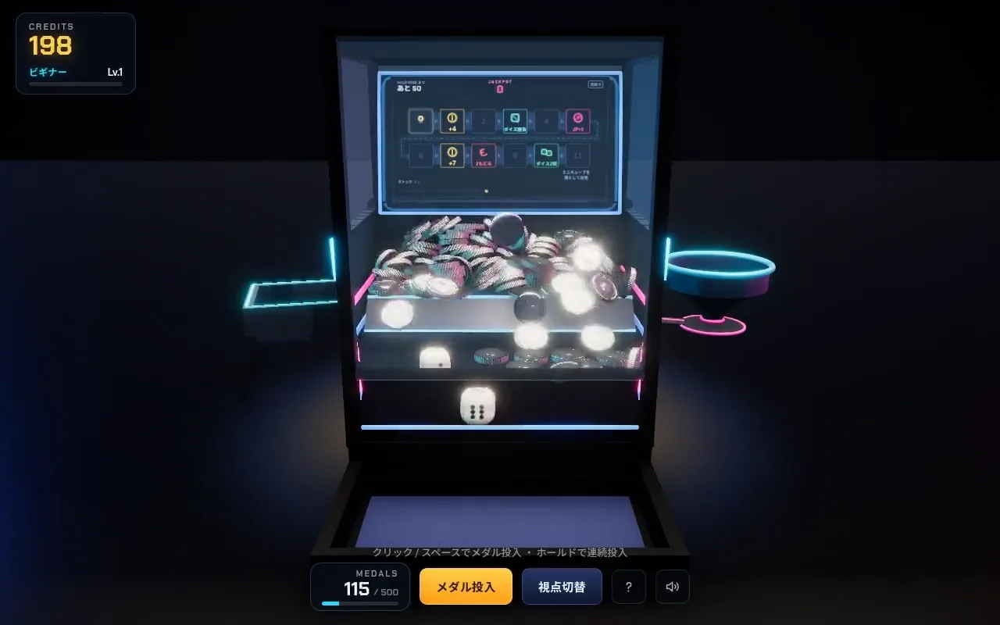
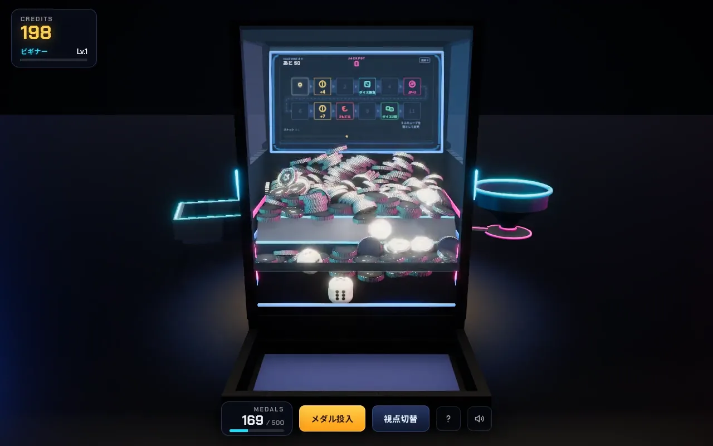
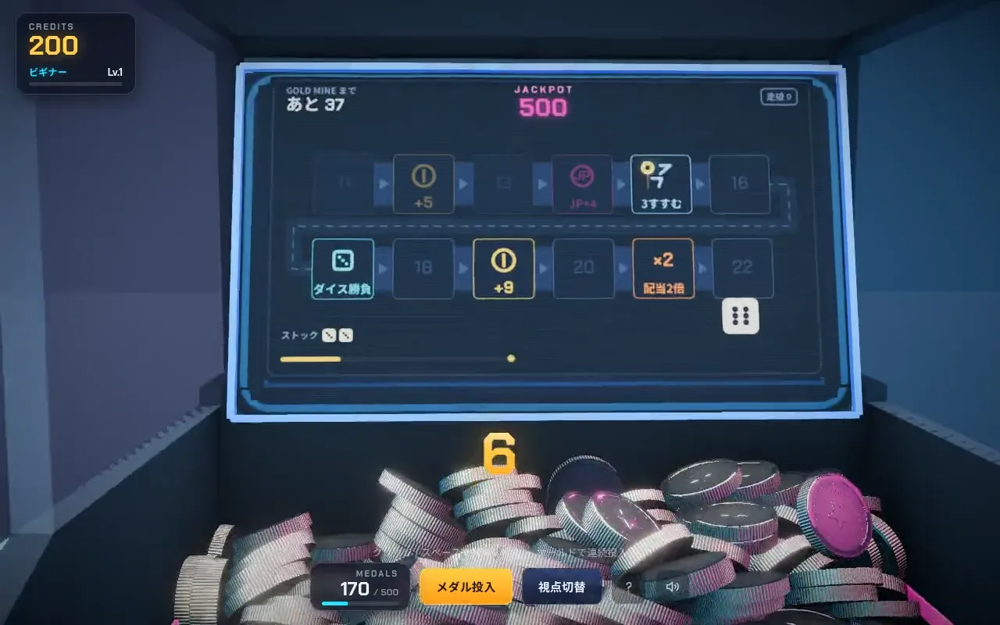
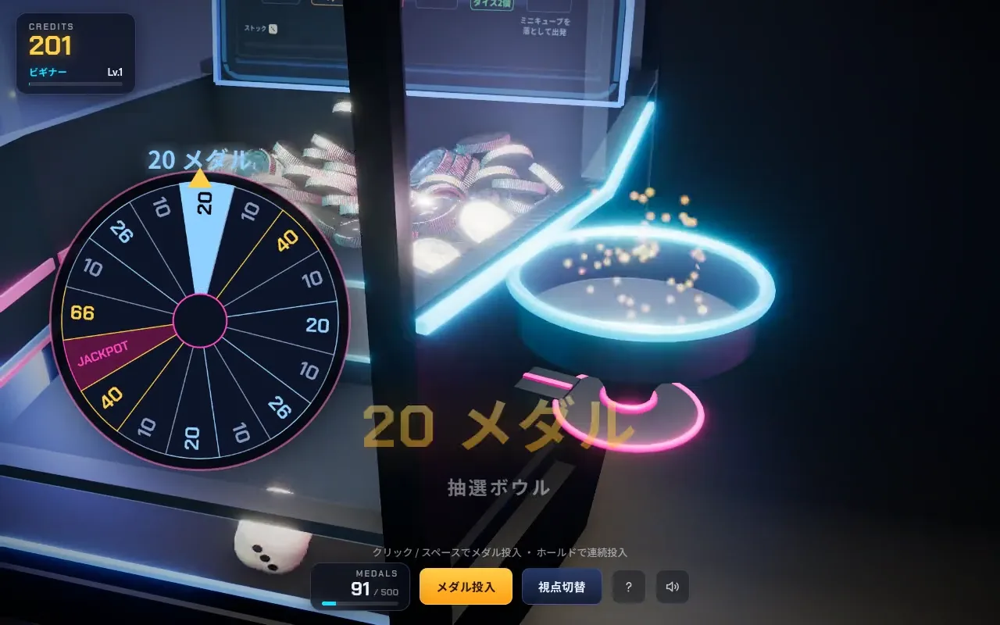
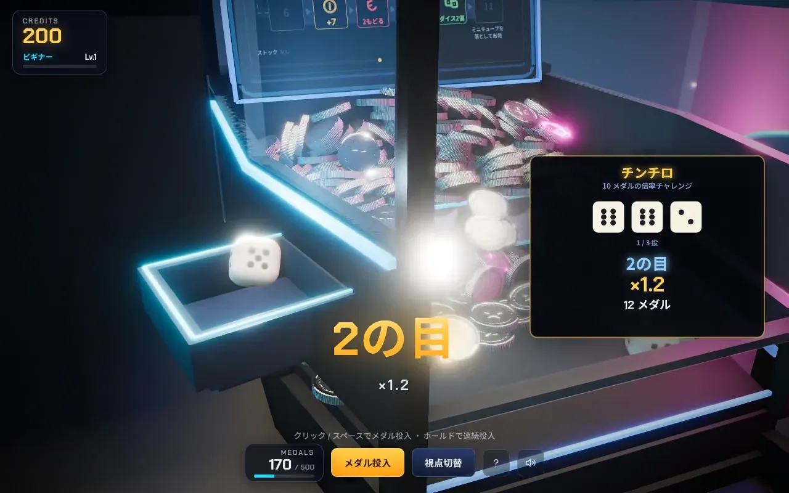

<!-- portfolio:begin -->
<!-- ここから portfolio:end までは自動生成です。直接編集しても次の生成で消えます。
     原本 : portfolio-site/src/data/projects.ts （slug: gold-rush）
     生成 : cd portfolio-site && npm run docs:emit
     点検 : cd portfolio-site && npm run check
     マーカーの外（ライセンス・クレジットなど）は手書きのまま残ります -->

# GOLD RUSH

> 物理エンジンごと再現した、ブラウザで動く 3D メダルプッシャー

**[作品ページ（動画つき）](https://kosei-matsuzaki.github.io/portfolio/works/gold-rush/)** ・ **[開発者向けドキュメント](docs/README.md)**

| 項目 | 内容 |
| --- | --- |
| 期間 | 2026年6月〜 |
| 体制 | 個人開発（ゲームデザイン・実装・チューニング） |
| 使用技術 | TypeScript / three.js / Rapier (物理) / Web Audio / Vite / Playwright |
| TypeScript（外部アセット 0） | 約8,400行 |
| 払い出し率（排出率の実測から逆算） | 90.2% |
| Playwright による E2E テスト | 8本 |

ゲームセンターのメダルプッシャー機を three.js + Rapier でブラウザ上に再現した作品です。プッシャーの基本ループに、モニター上のすごろく盤面と、抽選ボウル・チンチロを連鎖させています。抽選は乱数でボールや出目を誘導せず、衝突・摩擦・重力だけで結果が決まります。テクスチャも効果音も外部アセットを使わず、すべてコードで生成しています。

*実プレイの録画（無音・ループ）。メダル投入 → すごろく → 抽選ボウル → チンチロと連鎖する*

**見どころ**

- 抽選ボウルもチンチロもサイコロも実物理。乱数でボールや出目を誘導していない
- 横穴からの排出率を実測して逆算し、払い出し率 90% に設計
- 画像・効果音まで外部アセット 0。`npm install` だけで同じものが手元で動く

## 連鎖するゲームループ

メダル投入 → プッシャーが押し出す → 落ちたメダルが払い出される、という基本ループの上に 3 つの抽選ステージを載せました。メダルを 40 枚入れるごとに出るダイスを前縁から落とすとすごろくが 1 手進み、GOLD MINE に着けば抽選ボウルへ、その結果が賭け金としてチンチロに載ります。

### ① メダル投入とプッシャー

投入したメダルは放物線を描いて奥のデッキに着地し、60Hz 固定タイムステップで往復するプッシャーに押される。投げ上げ初速は重力から逆算しているので、重力を変えても飛距離が崩れない

*連続投入中。最大 500 枚が同時に転がっても InstancedMesh 2 枚のまま*

### ② すごろく（奥のモニター）

左のトレイで実物理のサイコロを振り、出た目だけコマが進む。GOLD MINE まで 50 マスの一本道。全ての段を左→右に固定し、段のあいだは S 字の連絡路でつないで「どっちが前か」を読み直さずに済むようにした

*1 手ぶんカメラがモニターに寄る。サイコロは演出ではなく実物理*

### ③ 抽選ボウル

漏斗状のボウルをボールが回りながら落ち、中央の穴へ吸い込まれる。左のルーレットは回り続けていて、ボールが消えた瞬間に指していたマス目が当たり。1/16 の JACKPOT を引けば累積ジャックポット全額

*物理が決めるのは「いつ落ちるか」だけで、その「いつ」が結果を決める*

### ④ チンチロ

ボウルの結果はそのまま払い出されず、賭け金としてチンチロに載る。トレイに実物理のサイコロを 3 個投げ、役で倍率が決まる。平均倍率は約 ×1.5 なので、ボウルの配当表そのものは低めに置いてある

*ピンゾロ ×5 / ゾロ目 ×3 / シゴロ ×2.5、ヒフミだけは ×0.5 で減る*

## 結果を仕込まない

抽選も演出も、できる限り実物理で行いました。ボウルもチンチロもサイコロも、乱数でボールや出目を誘導していません。乱数が入っているのは盤面のマス構成とジャックポットの積立だけです。

ダイスが必ず前面へ届くのも仕掛けではなく寸法です。一辺 0.52 に対して横穴の開口が 0.46 しかないので、物理的に横穴を抜けられません。

## メダル収支の設計

払い出し率は約 90% です。数字を決め打ちしたのではなく、横穴（ハウスエッジ）から抜けるメダルの割合を専用テストで実測（29.3% ± 1.9%、n=2331）し、そこから逆算しました。

### 効くレバーは横穴の寸法

効くのは横穴の寸法と、1 手ぶんの値段（`medalsPerBall`）。盤面の配当倍率を 4 割落としても払い出し率は 4 ポイントしか動かず、盤面がケチに見えるだけだった

### 寸法を触ったら測り直す

メダルを大きく厚くしたときに排出率が 48% → 24% まで落ち、払い出し率が 110% を超えて胴元が負けた。太いコインはテーパーに押されて壁から遠ざかるため

| 還元チャネル | 投入 1 枚あたり |
| --- | --- |
| 横穴を抜けずに前面へ戻る分（素通り） | 70.7% |
| 盤面・抽選ボウル・チンチロの払い出し | 9.2% |
| ジャックポット（長期平均） | 10.4% |
| 合計（払い出し率） | 90.2% |

*投入 1 枚が返ってくる内訳。いちばん上の素通り分は設計でどうにもできない下限で、残り 20 ポイントを 3 つのチャネルが取り合っている*

## 作りの工夫

### 物理と描画を分ける

Rapier の剛体が唯一の座標の持ち主で、three.js は毎フレームそれを転写するだけ。固定タイムステップ 60Hz の物理ループと可変レートの描画ループを分け、演出やチューニングが物理の再現性を壊さないようにした

### 外部アセットを持たない

メダルのギザ・リム・打刻はアルベド / バンプ / ラフネスの 3 枚が一致する形で Canvas 2D から生成し、効果音は Web Audio のオシレータ / ノイズ合成で作っている

### 非決定的な挙動を検証する

結果が毎回変わるので、期待値の一致では検証できない。状態機械の遷移を観測して「起動 → 投入 → 払い出し」「すごろく → 抽選ボウル → チンチロ」が必ず解決することを Playwright で確かめる方式にした。描画を飛ばして物理だけ進める turbo を入れ、10 分超かかっていたテストを十数秒にしている

## 生成 AI の活用について

- 企画・ゲームデザイン（すごろく + 抽選ボウル + チンチロの連鎖構造、ダイスを横穴より大きくして前面へ届かせる仕掛け）と仕様の決定は自分
- 「抽選はスクリプト誘導ではなく実物理で」「トレイとボウルは壁に直付けにする」など、実機で遊んだ感覚に基づく指示を数十回のイテレーションで反復。初版のスロット + 円盤チャレンジの構成を全面的に作り直す判断も自分
- AI には指示に基づく実装・E2E テスト作成・物理パラメータ調整の試行を担当させ、見た目・手触り・確率感の受け入れ判断は自分が行った

---

動かし方・設計資料・開発メモは **[docs/README.md](docs/README.md)** にまとめています。  
動画つきの詳しい版: https://kosei-matsuzaki.github.io/portfolio/works/gold-rush/

<!-- portfolio:end -->

## 使用ライブラリとライセンス

本プロジェクトのコード・画像・音はすべてこのリポジトリ内で生成したオリジナルです。
外部アセット（モデル・テクスチャ・音源・フォント）は使用していません。

| ライブラリ | 用途 | ライセンス |
| --- | --- | --- |
| [three.js](https://threejs.org/) | 3D 描画 | MIT |
| [@dimforge/rapier3d-compat](https://rapier.rs/) | 物理エンジン | Apache-2.0 |
| [postprocessing](https://github.com/pmndrs/postprocessing) | ポストエフェクト | Zlib |
| [n8ao](https://github.com/N8python/n8ao) | アンビエントオクルージョン | ISC |
| vite / TypeScript / Playwright | ビルド・型・E2E（開発時のみ） | MIT / Apache-2.0 |
