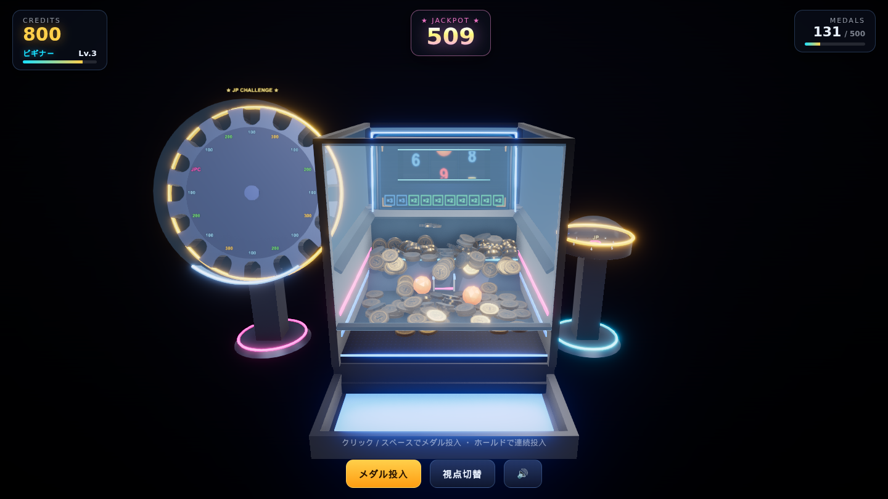
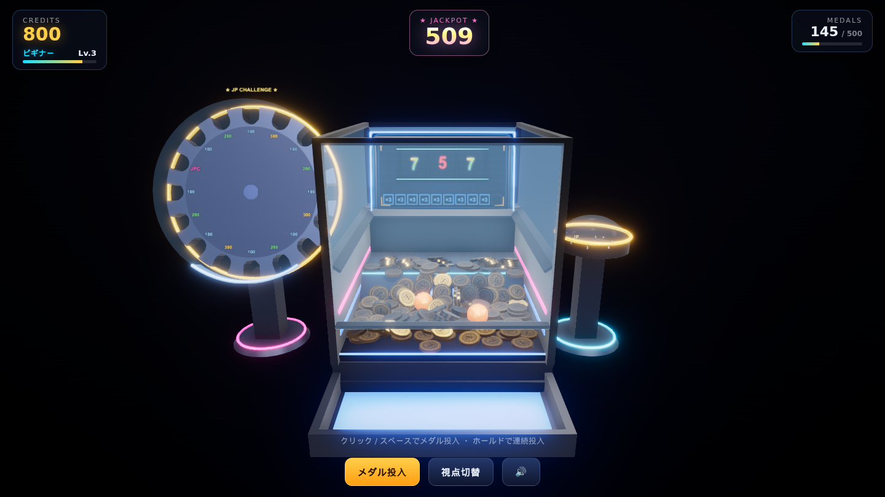
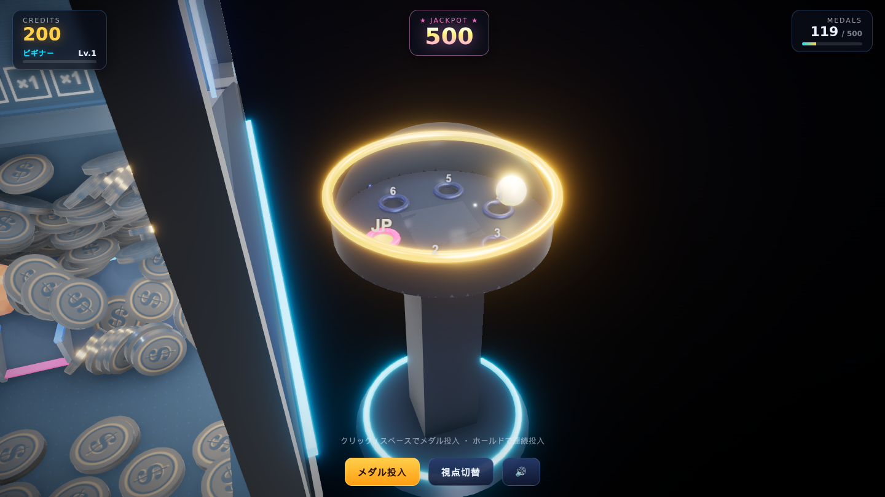
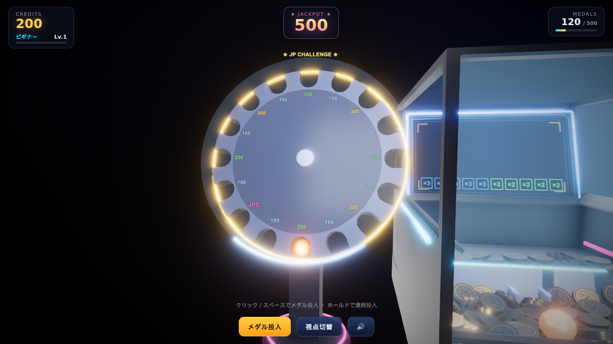

# 作品説明資料 — GOLD RUSH（ブラウザ 3D メダルプッシャー）

| 項目 | 内容 |
| --- | --- |
| 作品名 | GOLD RUSH — 3D メダルプッシャー |
| 形態 | ブラウザゲーム（PC 推奨、インストール不要） |
| 開発期間 | 2026年6月〜7月（約3週間） |
| 規模 | TypeScript 約 6,000 行 / 外部アセット 0（画像・音まで全て手続き生成） |
| 主要技術 | TypeScript / three.js / Rapier(物理) / Web Audio / Vite / Playwright |
| 開発体制 | 個人制作（AI コーディングエージェント Claude Code を併用 — 後述） |

---

## 1. 概要

ゲームセンターのメダルプッシャー機を、物理エンジンごとブラウザ上に再現した作品です。
「メダルを投入する → プッシャーが押し出す → 落ちたメダルが戻ってくる」という
プッシャーの基本ループに、3つの抽選ステージが連鎖します。

```
メダル投入 ──▶ プッシャー盤面 ──▶ 前縁から払い出し（クレジット還元）
                  │
                  └─ 中央レーン通過 ──▶ スロット（ストック式・FEVER あり）
                                          │ BALL揃い
                                          ▼
                              物理ボールがフィールドに排出
                                          │ 4個落下で発動
                                          ▼
                              円盤チャレンジ（実物理の穴抽選・天井あり）
                                          │ JP-Chance 穴
                                          ▼
                              JPチャレンジ（16ポケットの大回転盤）
                                          │ JPC ポケット
                                          ▼
                              累積ジャックポット獲得！
```

こだわったのは **「抽選も演出もできる限り実物理で行う」** ことです。
円盤チャレンジと JPチャレンジは結果を乱数で仕込んでボールを誘導するのではなく、
回転体とボールの衝突・摩擦・重力だけで結果が決まります（落ちた穴がそのまま結果）。
このため「入りそうで入らない」緊張感が本物のメダル機と同じ原理で生まれます。

## 2. スクリーンショット

| | |
| --- | --- |
|  | **メインプレイ画面** — 2段式プッシャー盤面。奥のモニターにスロットとストック状況を常時表示 |
|  | **スロット抽選** — 中央レーン通過でストックが貯まり自動連続抽選。リーチ・激アツ・FEVER 演出 |
|  | **円盤チャレンジ** — 回転円盤にボールを投入し実物理で穴抽選。ハズレ穴は埋まったまま持ち越し（天井システム） |
|  | **JPチャレンジ** — 外周に16個の U字ポケットを刻んだ大回転盤。振り子運動するボールが物理的に噛み合った先が結果 |

## 3. 動かし方

Node.js 20 以降があれば 2 コマンドで起動します（外部アセットのダウンロード不要）。

```bash
npm install
npm run dev     # → http://localhost:5173 をブラウザで開く
```

| 操作 | 内容 |
| --- | --- |
| クリック / Space | メダル投入（ホールドで連続投入、←→キーで狙い調整） |
| 右ドラッグ / ホイール / 中ドラッグ | 自由視点カメラ（オービット / ズーム / パン） |
| ` / F2 | 開発者パネル（各ミニゲームの強制起動・クレジット付与など、動作確認用） |

> 短時間で全要素を確認したい場合は、開発者パネルから「ディスク」「JP」を直接起動できます。
> 進行状況（クレジット・レベル・円盤の埋まり状況・累積JP）は localStorage に自動保存されます。

## 4. 技術的な見どころ

### 物理とレンダリングの分離
Rapier の剛体が唯一の座標の持ち主で、three.js は毎フレームそれを転写するだけの
一方向データフローです。固定タイムステップ（60Hz）の物理ループと可変レートの描画
ループを分離し、演出やチューニングが物理の再現性を壊さない構造にしています。

### 500枚のメダルを2ドローコールで
全メダルは InstancedMesh 2枚（通常/発光JP）+ 剛体プールの再利用で管理し、
最大500枚が同時に転がってもドローコールは増えません。CCD の選択的無効化・
ソルバ反復数の調整など、物理コストのボトルネックを計測しながら削りました。

### 「結果を仕込まない」抽選設計
スロットは `Economy.ts` に集約した乱数（確率はすべて定数で宣言、2万回サンプルの
分布テストで検証）。一方、円盤チャレンジと JPチャレンジは**乱数を使いません**。
- 円盤: トライメッシュの円盤に球面くぼみを掘り、投げ込まれたボールが摩擦と重力で
  空いている穴に落ちる。埋まった穴には物理コライダーが残るので確率が自然に変化。
- JPC: 円盤外周を U字にくり抜いた形状を `THREE.Shape` から押し出し、その断面が
  そのまま衝突形状になる。ボールはレール上の振り子運動と回転盤のタイミングが
  合った瞬間にだけポケットに噛み合う。

### 外部アセット完全ゼロ
テクスチャ（金属の粗さマップ等）は Canvas 2D で、環境光は `RoomEnvironment` で、
効果音はすべて Web Audio のオシレータ/ノイズ合成で生成しています。
リポジトリを clone して `npm install` するだけで完全な見た目と音が再現されます。

### E2E テストによる検証
Playwright + headless Chromium の自動テストを 9 本用意し、「起動→投入→払い出し」
「スロット→idle 復帰」「円盤→JP 連鎖→ジャックポット払い出し」「確率分布」
「高負荷時の物理安定性」までを毎回の変更後に回して開発しました。
物理抽選は結果が非決定的なため、デバッグ API（`?debug` → `window.__medal`）で
状態機械の遷移を観測して「必ず解決すること」を検証する方式にしています。

## 5. AI（Claude Code）の利用について

本作品は Anthropic の AI コーディングエージェント **Claude Code** を全面的に併用して
開発しました。役割分担は以下の通りです。

**人間（本人）が担当したこと**
- 企画・ゲームデザイン（プッシャー + スロット + 円盤 + JPC の連鎖構造、天井システム等）
- 仕様の決定と細かな挙動の指示（例:「JPC のポケットは断面が U字になるように外周をくり抜く」「レールと円盤のなす角は90度」「抽選はスクリプト誘導ではなく実物理で」など、実機で遊んで得た感覚のフィードバック）
- 実機での動作確認・ゲームフィールの評価と、それに基づく再調整の指示（数十回のイテレーション）
- 受け入れ判断（見た目・手触り・確率感が意図通りかの最終判断）

**AI が担当したこと**
- 上記の指示に基づく実装コードの生成・リファクタリング
- E2E テストスクリプトの作成と実行による自己検証
- 物理パラメータ調整の試行（人間の「入らない/物理的に変」というフィードバックを受けて原因を分析し、減衰・傾き・溝幅などの候補を試す）

AI に任せきりにするのではなく、**「意図を言語化して指示し、結果を実際に遊んで評価し、
差分を再指示する」** という反復で品質を作り込みました。特に物理抽選まわりは
「ボールがポケットに入らない」「挙動が物理的に不自然」といった問題を実プレイで発見し、
原因の仮説出し→パラメータ変更→自動テストでの回帰確認、というループを繰り返しています。
生成コードはすべて自分でレビューし、アーキテクチャ（物理と描画の分離、イベント駆動、
チューニング値の集約）を一貫させています。

## 6. 今後の拡張余地

- スロット確率・配当バランスの本格調整（現在は初期チューニング）
- モバイル対応（タッチ操作は実装済み、パフォーマンス最適化が未検証）
- 追加ミニゲームやイベント演出（アーキテクチャ上、`MiniGame` インターフェース実装で追加可能）
